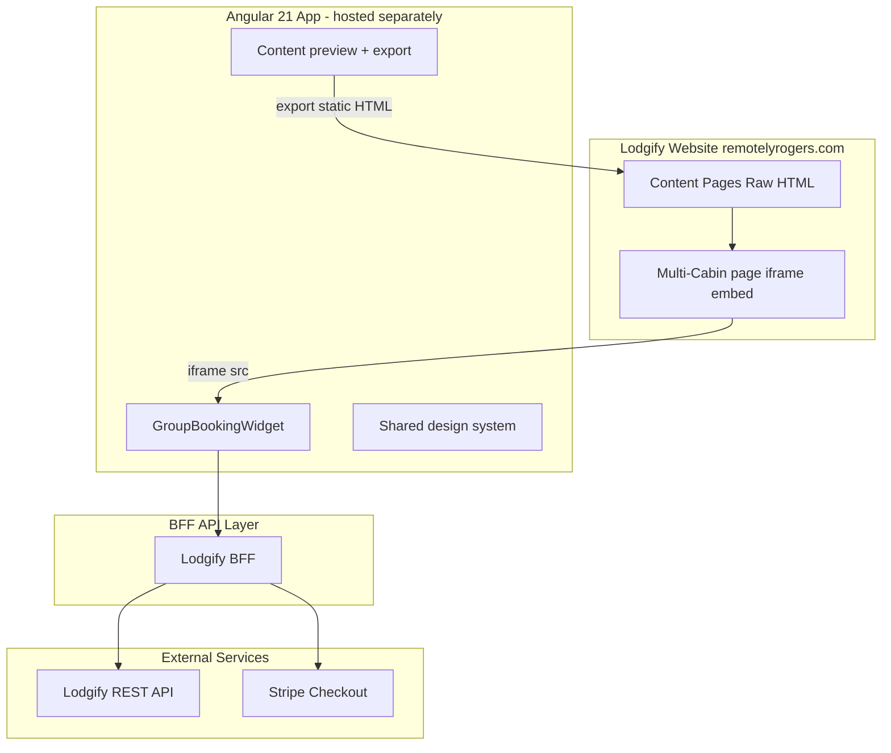

# Remotely Rogers — Angular 21 Implementation Plan

**Goal:** Modernize four Lodgify content pages and ship a guest-facing multi-cabin booking experience, built as an **Angular 21** app embedded into Lodgify — not vanilla JS.

**Live site:** [remotelyrogers.com](https://remotelyrogers.com)  
**Lodgify builder:** [app.lodgify.com/website-builder/631648](https://app.lodgify.com/website-builder/631648)

**Current repo:** Angular CLI 21.2 (`ng serve`, `ng build`, `ng generate`) — scaffold is in place; features below are the build plan.

---

## 1. Constraints (from discovery)

| Topic | Reality |
|-------|---------|
| Lodgify MCP | No official MCP; optional community [lodgify-mcp](https://github.com/MikeRobGIT/lodgify-mcp) — see [lodgify-mcp-setup.md](lodgify-mcp-setup.md) |
| PrimeNG + MCP | UI library installed; official [@primeng/mcp](https://www.npmjs.com/package/@primeng/mcp) in `.cursor/mcp.json` — see [primeng-mcp-setup.md](primeng-mcp-setup.md) |
| `/calendar/multi` | Host-only admin calendar — **cannot** be embedded on the public site |
| Single checkout | Lodgify books **one property per transaction**; multi-cabin “one cart” needs Angular + BFF + Stripe (or sequential fallback) |
| Lodgify builder | Content pages: native widgets + **Raw HTML**; Angular app deploys separately, embedded via iframe |
| `all-properties` bug | “undefined Results” fixed in Lodgify dashboard — see [lodgify/fixes/all-properties.md](lodgify/fixes/all-properties.md) |
| Live content today | Activities, Recommendations, Work Stays use basic AI text + emoji headers — replace with Angular-designed layouts |

---

## 2. Recommended architecture



### Why Angular is hosted separately

Lodgify Raw HTML accepts static HTML/CSS — it does **not** run `ng build` or `ng serve`. Workflow:

1. Develop in Angular (`ng serve`)
2. Export static HTML for content pages (`npm run export:lodgify-snippets`)
3. Build production app (`ng build --configuration production`)
4. Deploy `dist/remotely-rogers/browser/` to Cloudflare Pages / Netlify
5. Paste iframe + exported HTML into Lodgify Raw HTML widgets

---

## 3. Project structure (Angular CLI)

Current layout and planned additions:

```
remotely-rogers/
├── src/
│   ├── app/
│   │   ├── features/
│   │   │   ├── content/              # Activities, Recommendations, Work Stays, Multi-Cabin hero
│   │   │   │   ├── activities/
│   │   │   │   ├── recommendations/
│   │   │   │   ├── work-stays/
│   │   │   │   └── multi-cabin-stays/
│   │   │   └── group-booking/        # Multi-cabin calendar + cart + checkout
│   │   │       ├── availability/
│   │   │       ├── cart/
│   │   │       ├── checkout/
│   │   │       └── quote-request/
│   │   ├── shared/ui/                # RrHero, RrCard, RrBadge, RrButton
│   │   ├── core/
│   │   │   ├── services/lodgify-api.service.ts
│   │   │   └── models/
│   │   ├── preview/                  # Dev routes to preview Lodgify paste output
│   │   ├── app.config.ts
│   │   └── app.routes.ts
│   ├── environments/
│   │   ├── environment.ts
│   │   ├── environment.prod.ts
│   │   └── cabin-config.ts           # Synced property IDs (no API key)
│   └── styles.scss                   # Design tokens
├── tools/
│   └── sync-properties.ts            # npm run sync-properties
├── dist/
│   ├── remotely-rogers/browser/      # ng build — deploy for iframe
│   └── lodgify-snippets/             # export:lodgify-snippets — paste into builder
├── docs/
└── angular.json
```

Optional later: migrate to **Nx** monorepo if you add a separate BFF app (`booking-api`). Not required for v1.

---

## 4. Angular CLI commands (replace legacy JS scripts)

| Old (pre-Angular) | New (Angular CLI) |
|-------------------|-------------------|
| `node scripts/build-snippets.js` | `npm run export:lodgify-snippets` |
| `node scripts/sync-properties.js` | `npm run sync-properties` |
| `booking-app/` vanilla Worker + HTML | Angular `group-booking` + separate BFF deploy |
| Manual HTML in `snippets/` | Angular components → exported HTML in `dist/lodgify-snippets/` |

### Scaffold features

```powershell
# Content pages
ng generate component features/content/activities --standalone
ng generate component features/content/recommendations --standalone
ng generate component features/content/work-stays --standalone
ng generate component features/content/multi-cabin-stays --standalone

# Group booking
ng generate component features/group-booking/shell --standalone
ng generate component features/group-booking/availability/date-range-form --standalone
ng generate component features/group-booking/availability/cabin-grid --standalone
ng generate component features/group-booking/cart/cart-summary --standalone
ng generate component features/group-booking/checkout/guest-details-form --standalone
ng generate component features/group-booking/quote-request --standalone

# Shared UI + services
ng generate component shared/ui/hero --standalone
ng generate component shared/ui/card --standalone
ng generate service core/lodgify-api
ng generate service features/group-booking/checkout
```

### Dev and build

```powershell
ng serve                              # http://localhost:4200
ng build --configuration production   # dist/remotely-rogers/browser/
ng test                               # Vitest via Angular 21
npm run export:lodgify-snippets       # dist/lodgify-snippets/*.html
npm run sync-properties               # tools/sync-properties.ts → cabin-config.ts
```

Add to `package.json` when tools are implemented:

```json
{
  "scripts": {
    "sync-properties": "tsx tools/sync-properties.ts"
  }
}
```

**Export pipeline (implemented):** `npm run export:lodgify-snippets` runs `ng build` with Angular SSR prerender (`app.routes.server.ts` + `tools/prerender-routes.txt`), then `tools/export-lodgify-snippets.mjs` extracts component markup and inlines CSS into `dist/lodgify-snippets/*.html`.

---

## 5. Angular 21 app — features

### 5.1 Content pages (Phase 1)

| Page | Component | Design direction |
|------|-----------|------------------|
| **Activities** | `ActivitiesComponent` | Hero + category cards (Outdoor, Biking, History, Dining) — replace emoji headers |
| **Recommendations** | `RecommendationsComponent` | Curated local picks grid + optional map embed |
| **Work Stays** | `WorkStaysComponent` | Remote-work value prop, amenities, CTA above inquiry form |
| **Multi-Cabin hero** | `MultiCabinStaysComponent` | Group stay benefits; iframe below for booking widget |

**Palette:** forest `#2d4a3e`, cream `#f7f4ef`, accent `#c45c3e`, font **Vollkorn** — see [lodgify/STYLES.md](lodgify/STYLES.md).

Preview routes (add to `app.routes.ts`):

```typescript
{ path: 'preview/activities', loadComponent: () => import('./features/content/activities/activities.component') },
{ path: 'preview/recommendations', loadComponent: () => import('./features/content/recommendations/recommendations.component') },
{ path: 'preview/work-stays', loadComponent: () => import('./features/content/work-stays/work-stays.component') },
{ path: 'group-booking', loadComponent: () => import('./features/group-booking/shell/shell.component') },
```

### 5.2 Group booking (Phase 2)

| Feature | Component / service | Behavior |
|---------|---------------------|----------|
| Date selection | `DateRangeFormComponent` | Check-in/out, guests per cabin (1–4) |
| Availability grid | `CabinGridComponent` | Rows = 6 cabins; inspired by admin multi-calendar |
| Cart | `CartSummaryComponent` | Signals: selected cabins, nights, total |
| Guest details | `GuestDetailsFormComponent` | Reactive form + validators |
| Checkout | `CheckoutService` | BFF `/api/checkout` → Stripe or sequential Lodgify URLs |
| Quote fallback | `QuoteRequestComponent` | BFF `/api/quote` |

### 5.3 State (signals — no NgRx for v1)

```typescript
availabilityMap = signal<Record<number, CabinAvailability>>({});
selectedCabinIds = signal<Set<number>>(new Set());
dateRange = signal<DateRange | null>(null);

selectedTotal = computed(() => /* sum selected */);
canCheckout = computed(() => selectedCabinIds().size > 0 && form.valid);
```

Use `inject()`, standalone components, `@if` / `@for`, `provideHttpClient(withFetch())`.

### 5.4 Environment (client-safe only)

```typescript
// src/environments/environment.prod.ts
export const environment = {
  production: true,
  apiBaseUrl: 'https://booking-api.remotelyrogers.com',
  siteBaseUrl: 'https://remotelyrogers.com',
  stripePublishableKey: 'pk_live_...',
};
```

**Never** put `LODGIFY_API_KEY` or Stripe secret in Angular environments.

### 5.5 Lodgify embed (after deploy)

See [lodgify/BUILDER-GUIDE.md](lodgify/BUILDER-GUIDE.md) for iframe snippet on Multi-Cabin Stays.

---

## 6. BFF API layer (required for group booking)

Deploy separately (Cloudflare Worker, NestJS, etc.). Angular calls BFF only.

| Method | Path | Purpose |
|--------|------|---------|
| GET | `/api/config` | Public cabin names/ids |
| POST | `/api/availability` | `{ arrival, departure, adults }` → per-cabin quote |
| POST | `/api/checkout` | Linked bookings + Stripe session URL |
| POST | `/api/quote` | Group quote email |

Lodgify API (server-side):

- `GET /v2/properties`
- `GET /v2/quote?PropertyId=&Arrival=&Departure=&People=`
- `POST /v1/reservation/booking` — one per cabin, `notes: "Group {uuid}"`

Payment strategy: [payment/PAYMENT-DECISION.md](payment/PAYMENT-DECISION.md).

---

## 7. Phase 1 — Content pages (Lodgify builder)

| Step | Action |
|------|--------|
| 1 | Build `ActivitiesComponent`, `RecommendationsComponent`, `WorkStaysComponent` |
| 2 | `npm run export:lodgify-snippets` |
| 3 | Lodgify → Raw HTML → paste each file → Publish |
| 4 | Apply [STYLES.md](lodgify/STYLES.md) in builder Styles tab |

Guide: [lodgify/BUILDER-GUIDE.md](lodgify/BUILDER-GUIDE.md)

---

## 8. Phase 2 — Group booking

### Sprint 1: Foundation (3–5 days)

- [ ] Add feature folders + shared UI components (`ng generate`)
- [ ] Preview routes for content pages
- [ ] BFF stub with `GET /api/config`
- [ ] Deploy empty Angular build to staging URL
- [ ] Verify iframe embed on test Lodgify page

### Sprint 2: Availability (3–5 days)

- [ ] `npm run sync-properties` → `cabin-config.ts`
- [ ] BFF `/api/availability` with Lodgify quotes
- [ ] `DateRangeFormComponent` + `CabinGridComponent`
- [ ] Unit tests (Vitest) for date validation, selection

### Sprint 3: Checkout (3–5 days)

- [ ] `GuestDetailsFormComponent`
- [ ] BFF `/api/checkout` + Stripe session
- [ ] Sequential fallback (Option B)
- [ ] E2E: select 2 cabins → checkout redirect

### Sprint 4: Polish (2–3 days)

- [ ] `QuoteRequestComponent`
- [ ] Mobile grid, skeletons, a11y
- [ ] iframe `postMessage` height resize
- [ ] Paste embed on live Multi-Cabin page + Publish

---

## 9. Phase 3 — QA & launch

- [ ] Fix All Properties “undefined Results” in Lodgify dashboard
- [ ] Cross-browser iframe (Chrome, Safari, iOS)
- [ ] Re-check availability before checkout
- [ ] Stripe reconciliation with client
- [ ] Mobile preview in Lodgify builder for `/en/*` pages

---

## 10. DevOps

| Environment | Angular URL | BFF URL |
|-------------|-------------|---------|
| Local | `localhost:4200` | `localhost:8787` or `3000` |
| Staging | `booking-staging.*.pages.dev` | staging API |
| Production | `booking.remotelyrogers.com` | prod API |

CI: `ng build`, `ng test`, deploy static assets + BFF on merge to `main`.

---

## 11. Testing

| Layer | Tool |
|-------|------|
| Components / services | `ng test` (Vitest) |
| BFF | Integration tests with Lodgify mock |
| E2E | Playwright (iframe book flow) |
| Manual | Lodgify live after Publish |

---

## 12. Client prerequisites

1. Lodgify **API key** (Settings → Public API)
2. All **6 cabins** published with photos, rates, availability
3. **Stripe** account (if single combined checkout)
4. **Quote email** (e.g. Jeff@remotelyrogers.com)
5. Hosting decision for `booking.remotelyrogers.com`
6. Real photos to replace placeholders

---

## 13. Delivery order

1. **Content page Angular components** → export → paste into Lodgify (immediate visual win)
2. **Group booking feature** + BFF
3. **Availability grid** (multi-cabin UX like admin calendar)
4. **Checkout** — Stripe + quote fallback
5. **Embed + launch** on Multi-Cabin Stays; fix all-properties listing

---

## 14. Optional: Lodgify MCP during development

Install community MCP to query properties and quotes while building the BFF — does not replace the Angular app. Setup: [lodgify-mcp-setup.md](lodgify-mcp-setup.md).

---

## 15. Risk register

| Risk | Mitigation |
|------|------------|
| iframe awkward on mobile | postMessage resize; “Open in new tab” link |
| Lodgify quote API quirks | `LodgifyApiService` + BFF integration tests |
| CORS from iframe | BFF allows `remotelyrogers.com` only |
| Bundle size | Lazy routes; production `ng build` |
