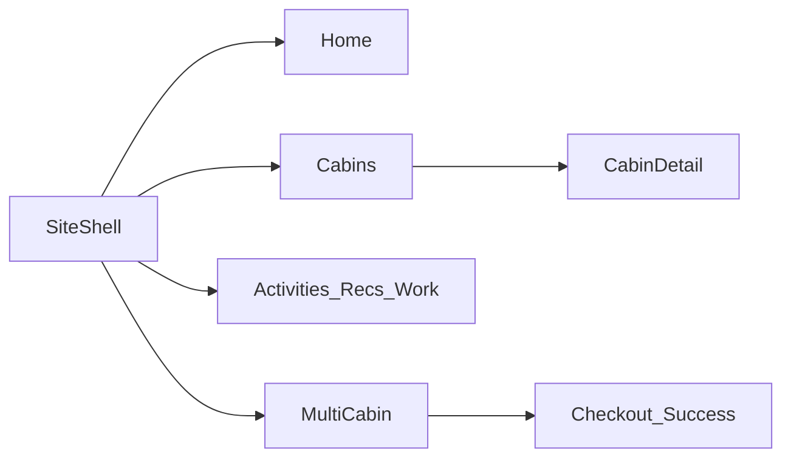

# Ozark maison Angular implementation plan

**Goal:** Replace the forest/Vollkorn preview site with the Option F Ozark maison public site, using the HTML in `public/mocks/` as the visual spec and PrimeNG for interactive widgets.

**Architecture:** Standalone, `OnPush` components. UI state is Angular signals (`signal`, `computed`, `linkedSignal`, `input`, `output`). Page copy and cabin facts live in typed content files, not in templates copied from `.dc.html`. Group booking keeps [`BookingStateService`](src/app/features/group-booking/booking-state.service.ts) as the signal store (it already owns cart, availability, and checkout signals). Do not add NgRx. Angular’s docs do not ship a SignalStore; `httpResource` is still experimental on Angular 21.2, so new reads stay on the existing `HttpClient` service and existing signals. Typed reactive forms stay for inquiry and checkout (signal forms are still preview).

**Tech:** Angular 21.2, PrimeNG 21 / `@primeuix/themes` Aura preset, SCSS, SSR prerender.

**Source of truth:** `public/mocks/F-00` through `F-07` plus `RRNav`, `RRFooter`, `RRMobileHeader`, `RRGroupCalendar`. Directions D/E and the homepage-concept files are not built. F-08 checkout, F-09 success, and F-10 contact were not in the export; those steps restyle the existing checkout and the live contact fields using F-00 tokens.

**Global constraints:**

- Fonts: Young Serif (display), Spectral (body), Archivo (UI). Ground `#F5F0E6`, walnut `#3E2C22`, oxblood `#6C2029` (hover `#882A34`, active `#561920`), brass `#B08A4A`, ink footer `#2B1F17`.
- USD, real copy, six cabin display names, 4 guests, 2-night minimum, host Jeff Wolfe, `479-440-5011`, `Jeff@remotelyrogers.com`.
- No fake card fields. Single-cabin Book now keeps the existing Lodgify property URL. Group Pay now stays the current Stripe handoff.
- PrimeNG for controls (`Button`, `DatePicker`, `Popover`, `Dialog`, `Drawer`, `InputNumber`, `Select`, `SelectButton`, `InputText`, `Textarea`, `Message`, `ProgressSpinner`). Editorial layout is custom HTML, not `p-card` / `p-panel` stacks.
- Production style budget is 12 kB per component. Shared shell SCSS, not copied page CSS.
- Do not ship `public/mocks/export/*.html` (~25 MB each) as site assets. Move the design export out of Angular `public/` in step 1.

## Step 1 — Foundations and site shell

Independently viewable at `/preview/foundations` and wrapped around existing preview routes.

- Move `public/mocks/` to `docs/design/claude-export/` (keep photos the app needs under `public/cabins/`). Update [`angular.json`](angular.json) only if assets still point at `public`.
- Replace forest tokens in [`src/styles/_tokens.scss`](src/styles/_tokens.scss) and the Aura primary scale in [`src/app/core/theme/remotely-rogers-preset.ts`](src/app/core/theme/remotely-rogers-preset.ts) with the F-00 hexes. Swap Vollkorn in [`src/index.html`](src/index.html) for Young Serif, Spectral, and Archivo.
- New `src/app/layout/`: `SiteHeader` (sticky nav + Check availability), `SiteFooter`, `MobileNav` (`Drawer`), `SiteShell`. Match [`RRNav.dc.html`](public/mocks/RRNav.dc.html) and [`RRFooter.dc.html`](public/mocks/RRFooter.dc.html).
- `BookingBar` using PrimeNG `DatePicker` + guest `Popover` (`InputNumber` for adults, children, infants, pets, max 4). It writes a small `SearchState` signal service (`checkIn`, `checkOut`, `guests`) and routes to `/cabins` with query params. No availability call yet.
- Vitest: guest cap and 2-night minimum on `SearchState`.

## Step 2 — Home

Route `/` (keep `/preview/*` until step 9).

- `features/home` reads cabin list from [`cabin-config.ts`](src/environments/cabin-config.ts) and reviews from [`reviews.data.ts`](src/app/features/content/reviews/reviews.data.ts).
- Sections from `F-01 Home.dc.html`: hero, discover + stats, comfortable cabins, book-one-or-several, per-cabin review carousel, two CTAs.
- Reviews modal is PrimeNG `Dialog` (F-01b). Carousel index is a `signal` / `linkedSignal` per cabin.
- `F-M01` is the same template under a 375px layout, not a second page.
- Do not port the mock’s `{{ b.short }}` template syntax; use real `@for`.

## Step 3 — Cabins listing

Route `/cabins`.

- `CabinSearchStore` (injectable signal service): dates and guests from query params, amenity filters, sort, `computed` result list. All six cabins are local data, so this is not an HTTP resource.
- F-02 layout: toolbar (`Button`, `DatePicker`, `Select` for sort), magazine list (not six identical Prime cards), map panel from the F-05/RRMap treatment (embed or static map, same on mobile as a tab).
- F-02b empty state and F-02c filters `Dialog`/`Drawer`. Never render “undefined Results”.
- F-M03 list/map tabs via a `signal`.

## Step 4 — Cabin detail

Route `/cabins/:slug`. One component, six slugs.

- Content file for facts that are not in `CABIN_CONFIG`: 2 bedrooms, 3 beds, 1 bath, amenity groups, rules, payment, cancellation, $250 hold, dog note, from $132.
- F-03: gallery, highlights, amenities, rules, map, rates, host, review carousel, sticky book widget.
- Gallery is `Dialog` (F-03b). Widget with dates (F-03c) shows nights × rate as a `computed`. Book now links to the existing Lodgify cabin URL with `from`/`to` query params.
- F-M02: sticky bottom bar; expanded widget is a `Drawer`.

## Step 5 — Activities

Route `/activities`. Restyle [`activities.ts`](src/app/features/content/activities/activities.ts); move the big data objects into `activities.data.ts`.

- `SelectButton` or a button group bound to a `selectedCategory` signal. `computed` lists for featured, trails, culture, dining.
- F-04 all, F-04b biking-only, F-04c empty filter with “Show all”.
- Drop `p-panel` / `p-card` chrome. Keep external links.

## Step 6 — Recommendations and Work Stays

Two separate routes, same shell. Can land in either order after step 1.

- `/recommendations`: six picks, tips, day plan, three vibes, map. Data already in [`recommendations.ts`](src/app/features/content/recommendations/recommendations.ts).
- `/work-stays`: office / nature / retreat, workday, three stay options, link to multi-cabin.
- Inquiry form (live Work Stays fields): email, first, last, guests, phone, dates, comment, cabin `Select`. Typed `FormGroup`. Submit shows a success `Message` (no backend in this step unless one already exists).

## Step 7 — Multi-cabin calendar

Route `/multi-cabin` (keep `/group-booking` as the full-screen calendar).

- Marketing hero and 3 steps from `F-07`, then the existing [`GroupBookingShell`](src/app/features/group-booking/shell/shell.ts).
- Restyle [`group-booking.scss`](src/styles/group-booking.scss) to F-00 / `RRGroupCalendar.dc.html`: legend, price cells, reserved/closed bars, cart. Do not rewrite selection logic in `BookingStateService`.
- Loading, error, and min-stay messages already exist; skin them (F-07c). `ProgressSpinner` and `Message`.
- F-M04: horizontal scroll of the existing table plus a sticky cart `Drawer`.

## Step 8 — Checkout, success, and contact

No mock files. Follow F-00 components.

- Restyle [`checkout-page`](src/app/features/group-booking/checkout/checkout-page/checkout-page.html) and [`checkout-success`](src/app/features/group-booking/checkout/checkout-success/checkout-success.html): guest fields, cart, Back, Pay now, per-cabin booked/failed, Book more cabins. No card inputs.
- New `/contact`: phone, email, address, map, and the live inquiry fields (email, name, phone, date, time window, rental, notes). Same form pattern as Work Stays.

## Step 9 — Public routing cutover

- [`app.routes.ts`](src/app/routes.ts): `/` is Home. Public paths: `/cabins`, `/cabins/:slug`, `/activities`, `/recommendations`, `/work-stays`, `/multi-cabin`, `/contact`, `/group-booking`, `/group-booking/checkout`, `/group-booking/checkout/success`.
- Redirect old `/preview/*` to the new paths.
- Update [`tools/prerender-routes.txt`](tools/prerender-routes.txt) and the document title.
- Leave Lodgify snippet export scripts in place until the live site actually moves off Lodgify. Do not restyle them back to forest green.

Each step is done when `ng test` passes for the new store/form specs and the route renders at 1440 and 375 against the matching `F-*` artboard (hero, type, oxblood CTA, and the interactive state named in that step).
